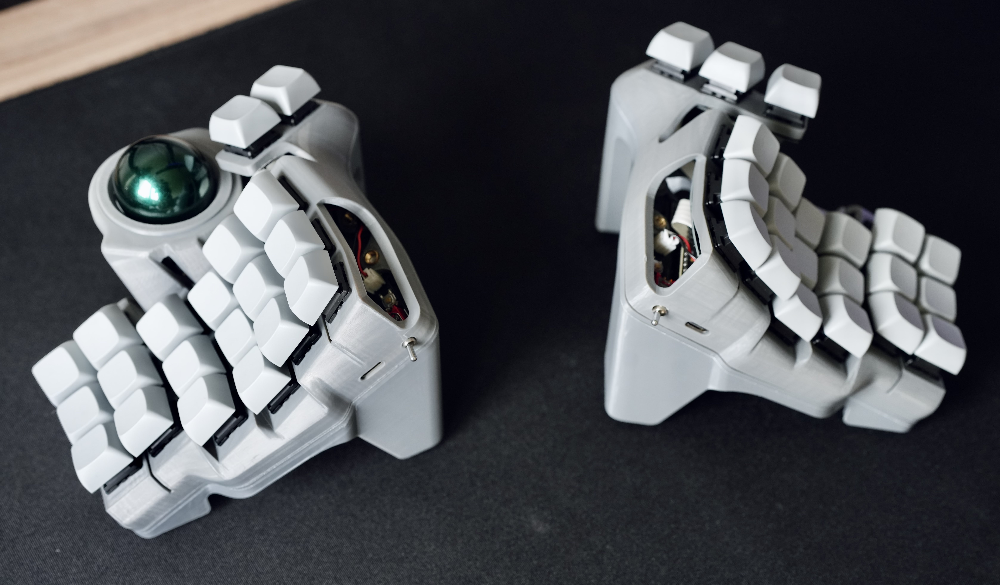

# Charybdis Wireless (3x6 aka Mini) Guide


#### Table of contents
* [Before we begin](#before-we-begin)
* [Disclaimer](#disclaimer)
* [Build Guide](#build-guide)
    * [1. Required Parts](#step-1-required-parts)
    * [2. Assembly](#step-2-assembly)
    * [3. Software](#step-3-software)
* [Thanks](#thanks)

# Before we begin

The Charybdis was created and designed by [Bastard Keyboards](https://bastardkb.com/) so I take no credit in the creation or design. To learn more about the Charybdis itself, read about it on [Charybdis Github](https://github.com/Bastardkb/Charybdis) repo. 

The purpose of this guide is mainly to take a note on what I have done to building a Wireless (Bluetooth) Charybdis, since there is almost no written guide when it comes to building a Wireless Charybdis. I am going to build a 3x6 Charybdis Mini, therefore my guide will be specifically for that. If you are planning to build Charybdis Nano (or add a rotary knob), etc.. Please fork and tweak it as you like (with reference please).

**Important notes:**
- As of writing this setup does not support RGB LEDs.

- The necessary files for PCBs and 3D files are scattered across Github, I will be referring to the each file specifically in this guide.

# Disclaimer 
**Follow at your own risk**, I am not liable for anything that does not work. If you are unsure of something I would suggest you stop by the Bastard Keyboards discord if you have questions. 

# Build Guide

## Step 1: Required Parts
### PCBs
I have ordered PCBs from JLCPCB.

For PCBs, most important part is, thumb parts needs to be thinner than usual. For building a nano or mini 0.8mm is enough, but for a full size, 0.6mm is recommended as flexibility is required. I did not change rest of the settings for other parts.

#### PMW3610 Breakout
[Link to Void's repo](https://github.com/victorlucachi/charybdis-pmw3610-breakout/tree/nicenano/production)

For this PCB, you will need to solder PMW3610 later.

For the assembly, JLCPCB did not have `TCR2EF19`, which I replaced it with `TLV70018DDCR`:
```
#(Old) TCR2EF19:
73dB@(1kHz) 200mA Fixed 1.9V Positive 5.5V SOT-23-5 Linear Voltage Regulators (LDO) ROHS


#(New) TLV70018DDCR:
68dB@(1kHz) 200mA Fixed 1.8V Positive 5.5V SOT-23-5 Linear Voltage Regulators (LDO) ROHS
```

#### Nice!Nano Holder
[Link to olidacombe's repo](https://github.com/olidacombe/Elite-C-holder/tree/nicenano/adapter/production)

This PCB Design supports having a power switch that makes use of audio jack hole.

#### PCB Thumbs
[Link to PCB thumbs](https://github.com/Bastardkb/Charybdis-PCB-thumbs/releases/tag/2.01)

Olidacombe also has a [fork](https://github.com/olidacombe/Charybdis-PCB-thumbs), in order to move wiring to left, but I personally did not use it.

### Flexible PCB Thumbs (for left)
[Link to repo](https://github.com/Bastardkb/TBK-Mini-PCB-thumb-cluster/releases/tag/2.1)

As I mentioned above, I ordered with 0.8mm thickness and did not change anything else (other than dying it to black at no extra cost on 0.8mm)


### Flexible PCB for the plate (3x6)
[Link to repo](https://github.com/Bastardkb/TBK-Mini-PCB-plate/releases/tag/2.21)

Again, I ordered with 0.8mm thickness and dyed it black

### 3D Prints
A good friend and a colleague of mine [pbacterio](https://github.com/pbacterio) assisted me with 3D prints. I will add the link of each part  have 3D printed for a 3x6 build. This is different from the official README, as it does not use bearings for trackball and uses ceramic bearing balls. Some of the designs require the 3D model to be mirrored, I will link my mirrored files in this repository (Please refer to [Disclaimer](#disclaimer)).

- [Right case 3MF](https://github.com/Bastardkb/Charybdis/blob/2dad0ca/files/3x6%20mini/CMini_v1_v11.3mf), [STEP file](https://github.com/Bastardkb/Charybdis/blob/9afdbc9/files/3x6%20mini/CMini_v1_v11.step)
- [Left case STL](./3d-prints/case_v3_v29_mirrorred.stl)
- [Right Plate STL](https://github.com/Bastardkb/Charybdis/blob/3908164/files/3x6%20mini/plate_v1_v11.stl)
- [Left Plate STL](./3d-prints/plate_v3_v29_mirrorred.stl)
- [Adapter - top STL](https://github.com/Bastardkb/Charybdis/blob/c818c76/files/3x5%20nano/adapter_v2_top_v75.stl)
- [Adapter BTU Bottom](https://github.com/Bastardkb/Charybdis/blob/d0e20cc/files/mods/btu/adapter_btu_bottom_v32.stl)
- [Printable 2.5mm BTU Ball](https://github.com/Bastardkb/Charybdis/blob/322faad/files/mods/printable-btu/printable_btu_2.5mm_ball.stl), You need 3 of these
- [Tent Left STL (Optional)](https://github.com/Bastardkb/Charybdis/blob/4924527/files/3x6%20mini/tent_v2_v57.3mf)
- [Tent Right STL (Optional)](./3d-prints/tent_v2_v57_mirrorred.stl)
- [Sensor Cover](https://github.com/Bastardkb/Charybdis/blob/9130a58/files/sensor_cover_v51.stl)

#### Tips after build
- I personally find tents too high could not find a good position to make use of them.
- I would like to replace plates with metal ones to add more weight, and also less flexibility as ribbon wires add pressure.
### Required Components
In this section, I will go through each component I have bought, and also give example links. As of writing, I locate in Netherlands, therefore I tried to source some of the parts across European countries. 

| Name                         | Count | Link                                                                                                                         |
|------------------------------|-------|------------------------------------------------------------------------------------------------------------------------------|
| Trackball                    | 1     | [Perixx Europe](https://eu.perixx.com/collections/accessory/products/18010)                                                  |
| nice!nano microcontroller    | 2     | [Splitkb.com](https://splitkb.com/collections/keyboard-parts/products/nice-nano)                                             |
| (optional) mill max sockets  | 2     | [Splitkb.com](https://splitkb.com/collections/keyboard-parts/products/mill-max-low-profile-sockets?variant=31945995845709)   |
| SOD123 Diodes                | 41    | [Splitkb.com](https://splitkb.com/collections/keyboard-parts/products/smd-diodes)                                            |
| Button, 4x4x1.5              | 2     | [Aliexpress](https://www.aliexpress.com/item/4001046134819.html)                                                             |
| PMW3610 module               | 1     | [Aliexpress](https://www.aliexpress.com/item/1005006208592770.html)                                                          |
| Mini Toggle Switch TS-6 SPDT | 2     | [Aliexpress](https://www.aliexpress.com/item/1005003684819561.html)                                                          |
| Batteries                    | 2     | [Aliexpress](https://nl.aliexpress.com/item/1005005348368664.html)                                                           |
| Ceramic Bearing Balls 2.5mm  | 3     | [Aliexpress](https://www.aliexpress.com/item/1005004239319689.html)                                                          |
| Flexstrip Jumper Cables      | 2     | [Aliexpress](https://www.aliexpress.com/item/1005003498734969.html)                                                          |
| Key Switches                 | 41    | [Aliexpress](https://www.aliexpress.com/item/1005003761194503.html)                                                          |
| M3 5mm Brass Melt Nuts       |       | [Aliexpress](https://www.aliexpress.com/item/1005003582355741.html)                                                          |
| M4 5mm Brass Melt Nuts       |       | [Aliexpress](https://www.aliexpress.com/item/1005003582355741.html)                                                          |
| M3 8mm Torx Screws           |       | [Aliexpress](https://www.aliexpress.com/item/1005006115217679.html)                                                          |
| M4 8mm Torx Screws           |       | [Aliexpress](https://www.aliexpress.com/item/1005006115217679.html)                                                          |
| JST plug 2-pin               | 2     | [Aliexpress](https://www.aliexpress.com/item/1005006115217679.html)                                                          |


#### Notes: Flexstrip Jumper Cables (Ribbon cables)
BastardKb docs mention you require 30 wire ribbon cables, but its not specifically mentioned what type or length is required. From the link I sent above, I bought a 24 Pin 82MM Length and 12 Pin 70MM Length just to make sure.

**After build**: 70mm length was not enough for thumb and sensor, and for 82mm one I ran into issues where cable snapped in 2 different occassions. I ended up using AWG28 cable to solder sensor! While its harder to solder as its very flexible, its much easier to handle if something goes wrong.

#### Notes: Batteries
One important part here is the battery. If you order a battery from Aliexpress to Europe, the order will be shipped with freight, meaning it will take ~2 months to arrive. Due to this reason, if you reside within EU, I would recommend to source a battery of your choice within EU. What needs to be considered before ordering any battery is to ensure that it is:
- 3.7V
- More than 80mAh
- If you want to squeeze the battery between nice!nano and and the holder PCB, then you need to be careful of its size. At [42keebs.eu](https://42keebs.eu/shop/parts/lithium-polymer-battery/?attribute_size=301230%20(80%20mAh)), it states that you can fit `350926`, `301230`, `401030` underneath the nice!nano microcontroller.
- Again, if you would like to fit a battery underneath nice!nano, you may want to buy [Mill Max Low Profile Sockets with Headers](https://splitkb.com/collections/keyboard-parts/products/mill-max-low-profile-sockets?variant=47060695646555) In order to create the gap in between.

For this build, I used a JST plug so I can take out batteries without the need of desoldering.

**After build**: Somehow batteries I ordered from Aliexpress came much faster! Another thing is I did not get Mill Max Low Profile Sockets with Headers, but with pins (accidentally) therefore I was unable to fit the batteries beneath nice!nano.

### Helper Tools

As I have never built any keyboard before, and technically its my first DIY electronics project, I had to source all parts I needed. So I got:

- Solder Iron: Its strongly recommended to get a good quality solder iron where you can change the temperature. From my research I have found that Hakko solder irons are overwhelmingly popular, however they are expensive. If you are not planning to build keyboards for a living, you can cut some costs by a cheaper alternative. I myself bought a [GALLUNOPTIMAL GOSprint150](https://www.amazon.nl/dp/B091J6TB43).
- Solder: There are two types of solder that can be used, leaded and lead-free. While leaded solder melts easier and its easier to desolder, lead itself is toxic, therefore its important not to inhale it. You can put a fan in front of you and have good ventilation and possibly wear a mask. Lead-free solder is a safer choice, but it melts harder. Make sure to wash your hands after you are done!
    - **After build**: Desoldering was painful with lead free solder
- Solder wick: Its a type of solder remover, can be handy during incidents
    - **After build**: Adding flux to board helped a lot when I wanted to use solder wick
- Solder brass: If solder tin gets stuck on the tip of your iron, this is your go to.
- Pliers: You will need them to cut flexstrip ribbon cables.
- Torx screw drivers: You need M3 and M4 screw drivers. You already may have one at home.
- Tweezers: You are going to need them to hold pieces together, and also deal with small parts such as SOD123 diodes. 
- Desoldering Pump: Can be handy in case of accidents.
- Solder flux: Optional, solder tins usually have tin inside nowadays, however it may be handy to have one.
- Solder Station silicon: Optional, to make sure not to damage the surface you are working on.

## Step 2: Assembly
Most of the steps are similar to building a Charybdis Nano. I will try to explain what I have done differently.

1. Install screw inserts: [BastardKB Docs](http://docs.bastardkb.com/bg_cnano/04screw_inserts.html)
1. Solder diodes: [BastardKB Docs](http://docs.bastardkb.com/bg_cnano/05diodes.html)
1. Solder PMW3610 to sensor board
    - There is a single orientation to solder it, I don't think you will have any issues in this step. I would recommend to take out the sensor cap while doing any soldering to prevent touching it via solder iron. There is also kapon tape on the sensor, before starting to use it I would recommend to take them out.
1. Solder power switch to nice!nano holder
1. Solder button
1. Solder JST female plug
    - I soldered it in the same orientation with button where I can also reach to it from the side. Assembling nice!nano holder to case becomes a bit tight but it barely fits without pressure.
1. Solder nice!nano
    - [This video from Joe Scotto](https://youtu.be/l5kAx08Iom4) helped me a lot in this part. As it mentions, temperature on nice!nano is important, do not go above 300 degrees Celsius.
    - **Important** If you run into issues with wiring and in need to do desoldering, make sure to take out the nice!nano first!
1. Try connecting battery and see if nice!nano works
1. Install ribbon cables (including sensor board): [BastardKB Docs](http://docs.bastardkb.com/bg_cnano/07ribbon_cables.html)
    - Overall I had a negative experience with ribbon cables in general. It got snapped twice, and its very painful to desolder. For soldering sensor I used AWG28 cables after needing to desolder twice. In the process I believe I killed my nice!nano after applying too much heat on nice!nano holder PCB.
    - Make sure to cut off extending parts of the cables after soldering to keep the PCBs flat it will make installing switches much easier.
1. Power it on, grab a tweezer and check if each switch and sensor is working, if all works perfect!
    - You can use your finger and see if sensor works correctly. If not you may have issues with wiring (I did this step 3 times unfortunately)
1. Install and solder switches
    - I watched BastardKB build videos on Youtube for this part!
1. Install sensor board
    - During sensor assembly, I initially did not understand BTU prints were supposed to be installed angled, and needs to go all in. This is important otherwise ball will stay too high and sensor will not be able to read it

## Step 3: Software
As of writing, I have zero knowledge of ZMK. ~~I have forked [EIGA's config repo](https://github.com/erenatas/zmk-config)~~, created a Github Actions which built the images required for the keyboard. Connecting nice!nano for the first time is its reset mode, all you need to do is to drag and drop built image, which will flash itself. No need to change names or anything. Right hand is the main controller which you can connect to it via bluetooth and left hand automatically is connected to right hand.

**07/04/2024**: You can find my zmk config here: [https://github.com/erenatas/zmk-config-charybdis-mini-wireless](https://github.com/erenatas/zmk-config-charybdis-mini-wireless), Added scroll support via forking [@grassfedreeve](https://github.com/grassfedreeve)'s config and adapted it to 3x6 mini. 

# Thanks
I would like to thank and give my gratitude to following people that helped to make this project into a reality. I believe you have ignited a DIY flame within me!
- [EIGA](https://www.youtube.com/watch?v=Mks7QDxFreY) with his Youtube.
- [BastardKB](http://bastardkb.com/)
- [VOID](https://github.com/victorlucachi)
- [olidacombe](https://github.com/olidacombe)
- My dear friend and colleague [pbacterio](https://github.com/pbacterio)
- Sigvah who became my build buddy
- My wife for her support!

And finally thank you for all the supporters in BastardKB Discord channel. You have an amazing community!
